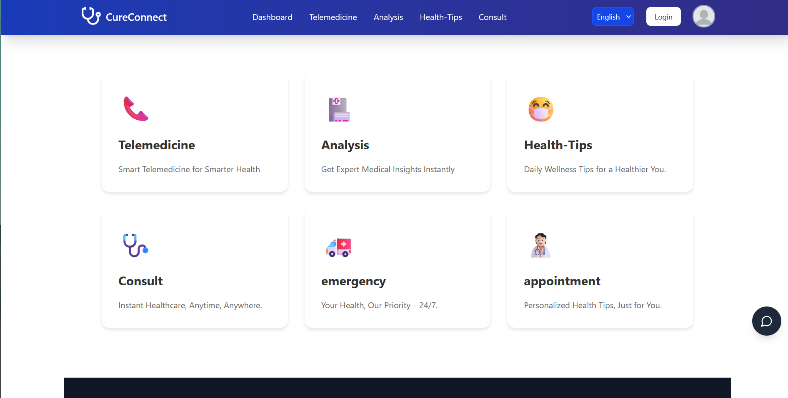
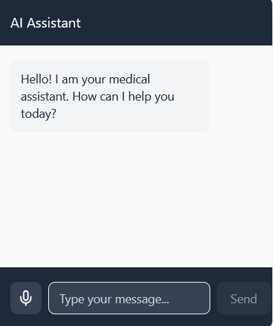
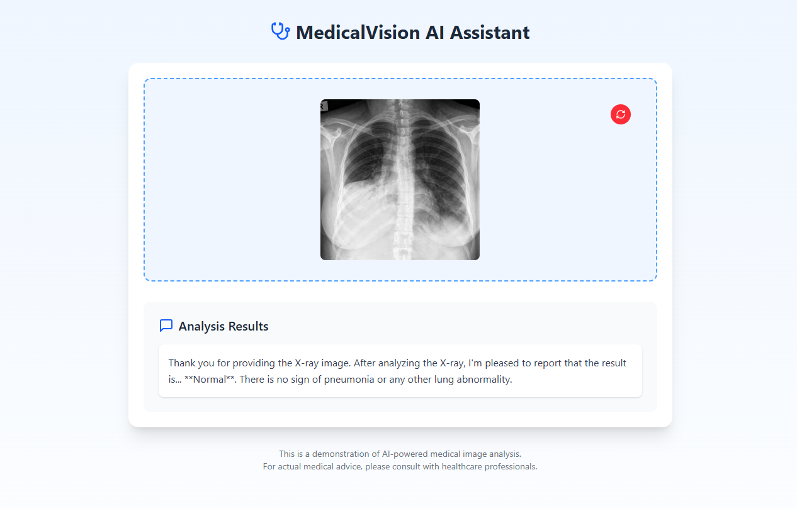
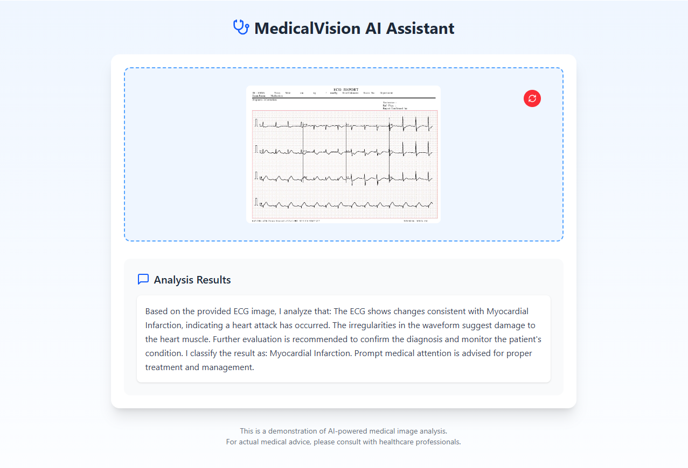
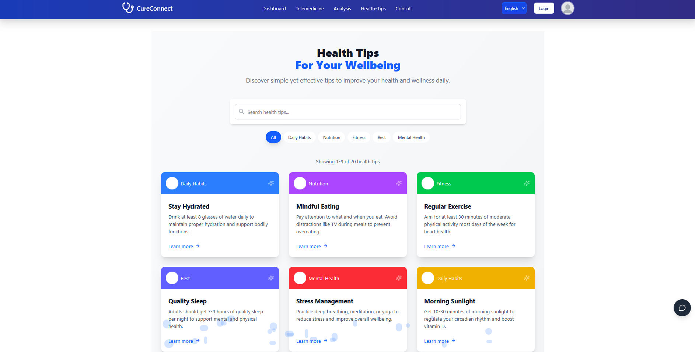
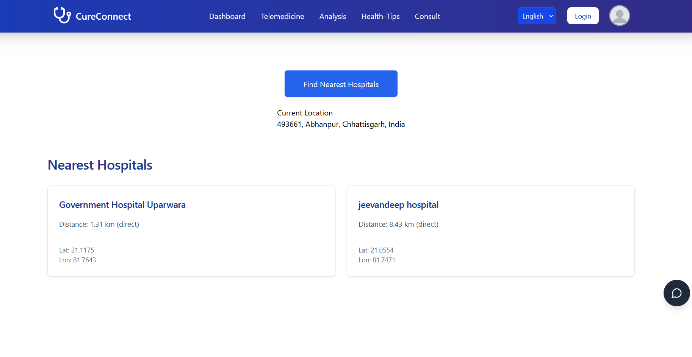
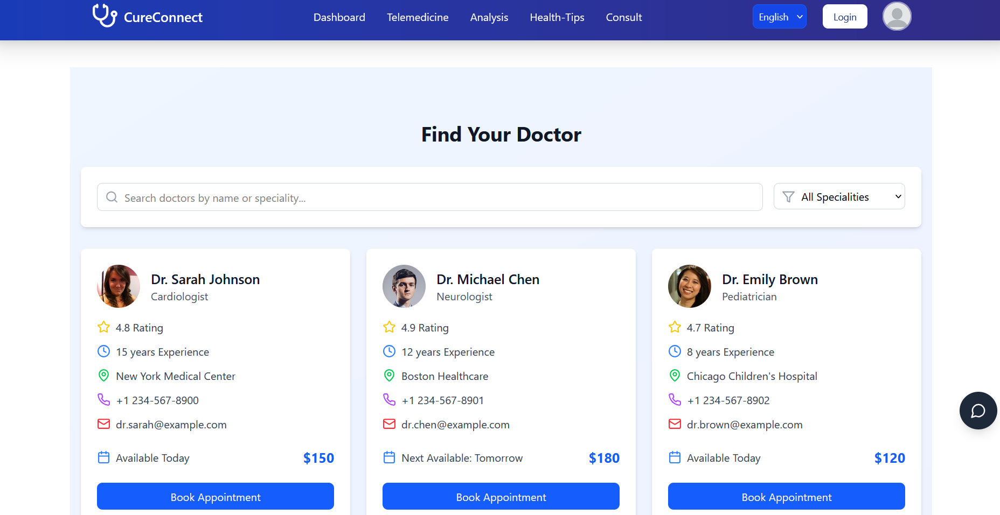
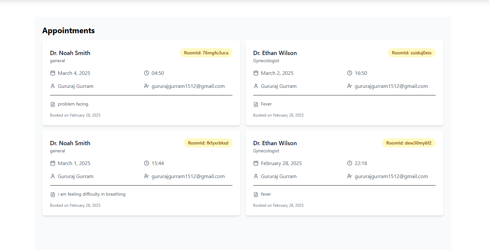

# CureConnect - Advanced Telemedicine Platform

## About CureConnect

CureConnect is an innovative telemedicine platform that bridges the gap between patients and healthcare providers. Our mission is to provide seamless, secure, and convenient access to healthcare services from the comfort of your home. With cutting-edge technology and a user-centric design, CureConnect is revolutionizing the way healthcare is delivered.

## Key Features

### 1. **Virtual Consultations**
- **HD Video Conferencing**: Enjoy crystal-clear video and audio for an effective doctor-patient communication experience.
- **Low Bandwidth Operation**: WebRTC technology ensures smooth consultations even on low-bandwidth connections.
- **Digital Prescriptions**: Receive prescriptions digitally after your consultation, simplifying the process.
- **Consultation History**: Easily access your past consultations, making follow-up care efficient and organized.

### 2. **Secure Messaging System**

- **End-to-End Encryption**: All communications are encrypted to ensure privacy and security.
- **Instant Responses**: Get quick responses to non-urgent queries without having to schedule a consultation.
- **Low Bandwidth Messaging**: Messaging is optimized for low-bandwidth environments to ensure accessibility at all times.

### 3. **Advanced Medical Analysis**

- **ECG Analysis**: Upload and receive professional interpretation of your ECG reports, ensuring timely diagnosis.
- **X-ray Interpretation**: Get expert analysis of your X-rays with comprehensive reports.
- **AI-Assisted Diagnostics**: Utilize AI technology for preliminary analysis, helping doctors make informed decisions.
- **Specialist Referrals**: Based on your diagnostic results, easily connect with specialists.
- **Secure Storage**: Store all medical images and reports securely for future reference.

### 4. **Personalized Health Insights**

- **Daily Health Tips**: Get personalized health recommendations based on your unique medical history.
- **Nutrition Guidance**: Receive tailored nutrition advice to improve overall health.
- **Exercise Plans**: Access fitness routines suited to your health condition and goals.
- **Medication Reminders**: Never forget a dose with smart reminders for your prescribed medications.
- **Wellness Articles**: Stay informed with expert-written articles on various health topics.

### 5. **Emergency Hospital Locator**

- **Real-time Hospital Mapping**: Quickly find the nearest hospitals during emergencies.
- **Ambulance Access**: Get immediate contact information for ambulance services.
- **Wait Time Indicators**: See estimated wait times at hospitals, helping you choose the best emergency care.
- **Specialty Filters**: Locate hospitals based on specific medical specialties.
- **Route Navigation**: Get step-by-step directions to the hospital of your choice.

### 6. **Comprehensive Appointment Dashboard**

- **Intuitive Calendar Interface**: Easily schedule, reschedule, or cancel appointments.
- **Availability Checker**: See real-time availability of healthcare providers for faster appointment scheduling.
- **Appointment Reminders**: Get timely reminders for upcoming appointments.
- **Integrated Payment System**: Pay for consultations directly through the platform for added convenience.
- **Follow-up Scheduling**: Effortlessly book follow-up appointments based on doctor's recommendations.

## Why Choose CureConnect?

- **24/7 Accessibility**: Healthcare services are available at your fingertips, anytime and anywhere.
- **Cost-effective**: Reduce the costs associated with in-person doctor visits, travel, and waiting times.
- **Time-saving**: Get fast access to healthcare professionals, saving time and avoiding unnecessary delays.
- **Comprehensive Care**: Access all healthcare services in one platform – from consultations to prescriptions and follow-up care.
- **Data Security**: Your medical information is safeguarded with the highest level of security, ensuring your privacy.

## How to Get Started

1. **Sign Up**: Create your account to begin using CureConnect.
2. **Book a Consultation**: Schedule your first virtual consultation with a healthcare provider.
3. **Start Your Healthcare Journey**: Explore features like prescriptions, health tips, and emergency services.

## Join the CureConnect Community

Thousands of users trust CureConnect for their healthcare needs. Become part of our growing community and experience healthcare made easy and efficient.

---

© 2025 CureConnect. All rights reserved.
